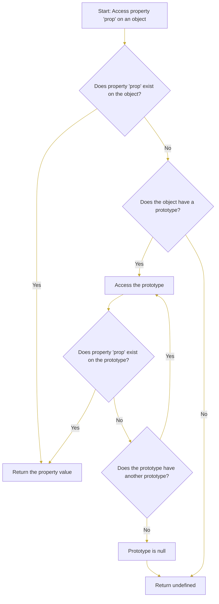

### Prototype in JavaScriptThis 
This section covers everything you need to know about Prototype in JavaScript, including their creation, storage, behavior, methods, and more.   
- [What is a Prototype](#what-is-a-prototype)
- [Prototype Characteristics: The Prototype Chain](#prototype-characteristics-the-prototype-chain)
- [.prototype vs .__proto__](#prototype-vs-__proto__)
- [Prototype in Object Creation Methods](#prototype-in-object-creation-methods)
- [Prototype Characteristics: Property/Method Creation & Access](#prototype-characteristics-propertymethod-creation-and-access)
- [Prototype Characteristics: Mutability](#prototype-characteristics-mutability)
- [Prototype Characteristics: Memory Storage](#prototype-characteristics-memory-storage)
- [Prototype Methods: Object.getPrototypeOf() and Object.setPrototypeOf()](#prototype-methods-objectgetprototypeof-and-objectsetprototypeof)
- [Prototype Methods: Object.prototype Methods](#prototype-methods-objectprototype-methods)
- [Prototype Methods: Bonus](#prototype-methods-bonus)

Go back to [basics listing](https://github.com/luizgdsmdev/Javascript-studies/blob/main/basics/intro.md). 

#### What is a Prototype
**Prototype** in JavaScript comes as a 'template' where objects can **share their properties and methods** with one another through what's called **Prototype Chain**. Once the 'template' is set, meaning it's created with or without properties and methods, we can now share its structure to serve as a base or complement to others, forming the basis of **JavaScript’s inheritance model**.   
Some of the reasons for this approach would be a more concise and non-verbose code, where: 
- By sharing structure, we need to write less code and, at the same time, maintain the quality and behavior of the objects;
- enables memory efficiency, because now we only need the instances to be declared once and, through the **Prototype Chain**, every object with a shared prototype has dynamic access to the reference of properties and methods, so no need to make insane amounts of instances.
And some more.

#### Prototype Characteristics: The Prototype Chain
The **Prototype Chain** works as a road, a chain of events that starts at the object level, **checking for its own properties and methods**. If **not found**, it goes through the **Prototype Chain** by checking the prototype of the object it inherited, and if it doesn't find again, keeps the process until it reaches the ``Object.prototype``, the origin proto for every object in JavaScript, meaning that it reaches the hights level of the search.
- If the property or method is found, the call returns its value;
- if not found, it keeps checking the nearest proto inherited until the element is found or reaches ``Object.prototype``.
If the element of the search **was never found**, the return will be ``undefined``, meaning it doesn't exist in the referred **Prototype Chain**.
Check below for more clarity on the chain flow:



#### .prototype vs .__proto__
You may see lots of these two around some code, and it's important to understand their differences. ``.prototype`` is a **property on a constructor function/class** that defines the shared prototype (properties and methods) for instances, and ``.__proto__`` is a getter/setter on an object instance that **points to its prototype**.
- ``Constructor.prototype``doesn't exist on regular objects or instances;
- ``.__proto__`` deprecated; use ``Object.getPrototypeOf()`` for modern code.
In other words, ``.prototype`` **defines** the prototype, while ``.__proto__`` **accesses** it for an instance.
###### Classe syntax
````javascript
class Human {
    constructor(name) {
        this.name = name;
    }
}
//Defining a method that will be shared with all instances shared via the prototype.
Human.prototype.speak = function() { return "Hello!"; };

const newObj = new Human('Marta');
console.log(newObj);//Shows Human { name: 'Marta' }

console.log(newObj.__proto__);//Shows { speak: [Function: speak], constructor: [Function: Human], ... }
console.log(Object.getPrototypeOf(newObj));//Shows { speak: [Function: speak], constructor: [Function: Human], ... }

console.log(newObj.__proto__ === Human.prototype);//Shows true
console.log(newObj.speak());//Shows "Hello!"
````
###### Constructor function
````javascript
function Human(name) {
    this.name = name;
}
//Defining a method that will be shared with all instances 
Human.prototype.speak = function() { return "Hello!"; };

console.log(Human.prototype);//Shows { speak: [Function: speak], constructor: [Function: Human], ... }

const newObj = new Human('Marta');
console.log(newObj);//Shows Human { name: 'Marta' }

console.log(newObj.__proto__);//Shows { speak: [Function: speak], constructor: [Function: Human], ... }
console.log(Object.getPrototypeOf(newObj));//Shows { speak: [Function: speak], constructor: [Function: Human], ... }

console.log(newObj.__proto__ === Human.prototype);//Shows true
console.log(newObj.speak());//Shows "Hello!"
````
Applying this logic, it is right to imagine that, for being an object, **both the class and the constructor function** also inherited. In this case, the prototype chain is directly from ``Function.prototype``, that later points to **Object.prototype**, closing the ``prototype chain``.
Let's check it:
````javascript
class ClassSyntax {
    constructor(name) {
        this.name = name;
    }
}

console.log(ClassSyntax.prototype.__proto__);//Shows {__defineGetter__: ƒ, __defineSetter__: ƒ, hasOwnProperty: ƒ, __lookupGetter__: ƒ, __lookupSetter__: ƒ, …}


function functionConstructor(name) {
    this.name = name;
}

console.log(functionConstructor.prototype.__proto__);//Shows {__defineGetter__: ƒ, __defineSetter__: ƒ, hasOwnProperty: ƒ, __lookupGetter__: ƒ, __lookupSetter__: ƒ, …}
````

#### Prototype in Object Creation Methods
We already covered [Objects](https://github.com/luizgdsmdev/Javascript-studies/blob/main/basics/objects/intro.md) in a different section, so here we're focusing on the prototype behavior on the most used ways for creating an object.   

###### Object Literal
Objects created with the object literal syntax have the ``Object.prototype`` by **default**, making it possible for us to use methods like ``toString()`` or ``hasOwnProperty()`` without any additional configuration or autoboxing.   
They do **not define a custom prototype** but can be linked to one using ``Object.setPrototypeOf()`` or extended manually.   
````javascript
let obj = { name: 'Luiz' };

console.log(obj.toString());//Shows '[object Object]'
console.log(Object.getPrototypeOf(obj) === Object.prototype);//Shows true

//Trying access to a non-existing property
console.log(obj.age);//Shows undefined
````

###### Object Constructor, Class Syntax, and Constructor Function
All three have the ``Function.prototype`` (that later points to ``Object.prototype``) by **default**, inheriting the same as the Object Literal Syntax.
````javascript
let obj = new Object();

console.log(obj.toString());//Shows '[object Object]'
console.log(Object.getPrototypeOf(obj) === Object.prototype);//Shows true

//Trying access to a non-existing property
console.log(obj.age);//Shows undefined
````

###### Object.create(proto)
Explicitly sets the specified proto as the new object’s prototype, offering precise control over the prototype chain.
````javascript
let proto = {age: 29};
let obj = Object.create(proto);

console.log(obj.toString());//Shows '[object Object]'

console.log(obj.age);//Shows 29
console.log(Object.getPrototypeOf(obj) === proto);//Shows true
````

#### Prototype Characteristics: Property/Method Creation & Access
As shown before, methods and properties can be shared across multiple objects for memory optimization and non-verbose code.   
Let's check a few ways for creating some:

###### Literal Syntax
For being a simple object, it can only handle the ``.__proto__`` for getting or setting on the prototype chain.
````javascript
//Creates the object
let proto = {age: 29};
console.log(proto)//Shows {age: 29}

let obj = Object.create(proto);//Inherit the 'proto' properties
console.log(obj);//Shows {}, it's empty because it doesn't have any own property or method yet
console.log(obj.__proto__);//Shows {age: 29}, was Inheret from 'proto'

//Changing the 'obj' property on own level
obj.age = 10;
console.log(obj);//Shows {age: 10}, it's own level
console.log(obj.__proto__);//Still showing {age: 29} inheret from 'proto'

//----------------------------------------------------------------------
//Creating a new method for 'proto' object
proto.__proto__.speak = () => console.log("This is from the 'proto' object.");

proto.speak();//Shows 'This is from the 'proto' obj.', it's own level
obj.speak();//Shows 'This is from the 'proto' obj.', inherited from 'proto'

//Changing the method by direct access to 'obj'. Changes only on the own level
obj.speak = () => console.log("Now it's comming from the 'obj' object.");

proto.speak();//Shows 'This is from the 'proto' obj.', wasn't affected by the change above
obj.speak();//Shows 'Now it's coming from the 'obj' object.', changed only on own level
````

###### Object Constructor, Class Syntax, and Constructor Function
```` javascript
//Creates the object
class Human{
  name = 'Luiz';
  constructor(age){
    this.age = age;
  }
}
console.log(Human.prototype);//Shows {speak: ƒ}, constructor: class, Humanspeak: ƒ speak(), [[Prototype]]: Object

//Inherit properties and methods from 'Human' class
let obj = new Human(29);
console.log(obj);//Shows Human {name: 'Luiz', age: 29}
console.log(obj.__proto__);//Shows {speak: ƒ}, constructor: class, Humanspeak: ƒ speak(), [[Prototype]]: Object

//Changes only on own level
obj.name = 'Marta';
console.log(obj);//Shows Human {name: 'Marta', age: 29}
console.log(obj.__proto__);//Shows {age: 10, speak: ƒ}, age: 10, constructor: class Human, speak: ƒ speak(), [[Prototype]]: Object


//----------------------------------------------------------------------
//Creating a new method and property for 'Human'
Human.prototype.speak =  function() {return "It's from Human class.";};
console.log(Human.prototype.speak());//Shows 'It's from Human class.'

console.log(obj.speak());//Shows 'It's from Human class.', inherited from Human class
console.log(obj.__proto__);//Shows {speak: ƒ}, speak: ƒ (), constructor: class Human, [[Prototype]]: Object


//__proto__ points to the prototype from the class, therefore, it's going to change not only for it's own but for 
//all existing instances from class Human
obj.__proto__.speak = function() {return "New source, changed from the 'obj' object.";};


console.log(Human.prototype.speak());//Shows 'New source, changed from the 'obj' object.' changed above by '__proto__'
let obj2 = new Human(30);

console.log(obj2.speak());//Shows 'New source, changed from the 'obj' object.', confirming that prototype was changed
````

#### Prototype Characteristics: Mutability
Prototypes are mutable, meaning we can add, change, or delete properties and methods at any time during the run time.   
As shown above, by changing the prototype, we're changing the reference where all instances are based, so the new information/structure is shared for all instances.
````javascript
//Creates the object
class Human{
  constructor(age){
    this.age = age;
  }
}

Human.prototype.name = 'Luiz';
Human.prototype.speak = function(){return "Hello!"};

let instance = new Human(29);
let instance2 = new Human(10);
console.log(instance.name);//Shows 'Luiz'
console.log(instance.speak());//Shows 'Hello!'
console.log(instance2.name);//Shows 'Luiz'
console.log(instance2.speak());//Shows 'Hello!'

Human.prototype.name = 'Marta';
delete Human.prototype.speak;

console.log(instance.name);//Shows 'Marta'
console.log(instance.speak());//Shows TypeError: instance.speak is not a function, because 'speak' no longer exists at this point

//Adding the 'speak' method by changing the prototype through 'instance2'
instance2.__proto__.speak = function(){return "Hello from instance2!"};

console.log(instance2.name);//Shows 'Marta'
console.log(instance2.speak());//Shows 'Hello from instance2!!'
console.log(instance.speak());//Shows 'Hello from instance2!', because by altering the '__proto__' at 'instance2' we change 
//the prototype of the Human class, reflecting all instances 
````
###### Shadowing
Shadowing at prototype means that, if we change a property or method at our own level of the object, this new value is **only applied to the object itself** and it's not reflected to all instances throughout the prototype chain.   
````javascript
function Human(name){
  this.name = name;
  this.speak = function(){return "Hello from the Human class!"};
}

let instance =  new Human('Luiz');
let instance2 = new Human('Marta');

console.log(instance);//Shows Human {name: 'Luiz', speak: ƒ}
console.log(instance2);//Shows Human {name: 'Marta', speak: ƒ}
console.log(instance.speak());//Shows Hello from the Human class!
console.log(instance2.speak());//Shows Hello from the Human class!

//Shadowing the 'name' property and speak method on instance2
instance2.name = 'JavaScript';
instance2.speak = function(){return "This is instance2 speaking!"};

console.log(instance);//Shows Human {name: 'Luiz', speak: ƒ}
console.log(instance2);//Shows Human {name: 'JavaScript', speak: ƒ}
console.log(instance.speak());//Shows Hello from the Human class!
console.log(instance2.speak());//Shows This is instance2 speaking!
````


#### Prototype Characteristics: Memory Storage
As shown above, the properties and methods from the prototype are shared similarly to an object or array, **through reference**. This approach is more optimized and **requires less memory** and code if compared to objects from literal syntax (``{}``), or Factory functions (returns and new object).   
The downside of this approach is that, by only passing the reference (when not copied), we must have caution when changing the prototype, to avoid errors and unwanted results mirroring the instances.


#### Prototype Methods: Object.getPrototypeOf() and Object.setPrototypeOf()
- ``Object.getPrototypeOf()``: as we saw some examples of its use above, this is a modern alternative for ``__proto__`` also returning the prototype of the own object, including inherited.
````javascript
let obj = Object.create({ name: 'Luiz' });
console.log(Object.getPrototypeOf(obj).name); // 'Luiz'
````

- ``Object.setPrototypeOf()``: sets a new prototype for an object, though this is discouraged due to performance costs. We could use ``.assign()`` as an alternative to add the new prototype without losing the existing one.
````javascript
let obj = Object.create({ name: 'Luiz' });
let proto = {speak: function(){return "Hello from proto!"}};

let instance = Object.create(obj);
console.log(instance.name);//Shows Luiz
//console.log(instance.speak());//Shows TypeError: instance.speak is not a function, because it doesn't exist yet

Object.setPrototypeOf(instance, proto);

console.log(instance.name);//Shows undefined, because 'proto' prototype overwritten the last one from 'obj' and 'name' no longer exist in
console.log(instance.speak());//Shows Hello from proto!
````

###### using ``.assign()``
````javascript
let obj = Object.create({ name: 'Luiz' });
let proto = {speak: function(){return "Hello from proto!"}};

let instance = Object.create(obj);
console.log(instance.name);//Shows Luiz

Object.assign(Object.getPrototypeOf(obj), proto);//Adding 'proto' prototype, without removing the last one from 'obj'

console.log(instance.name);//Shows Luiz, property wasn't overwritten by adding the new one
console.log(instance.speak());//Shows Hello from proto!
````


####

###

